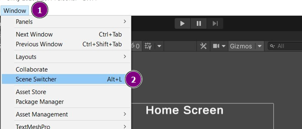

# Quick Scene Switcher
****
## Introduction
This tool enables the user to quickly switch between scenes. The scenes are by default sorted in ascending order by their names

Tool can be started either by pressing __Alt + 'L'__ or from menu __Tools > Scene Switcher__.

****
## Usage

* __Location__: Path of the folder can be passed from which all scenes are to be listed AS
* __Open Scene Additive__: If selected, all the next scenes will get opened in additive mode.
* __Refresh__: If new scenes are not updated in list, quick refresh will help !!
****
## Unity Support
Tool is tested on **Unity Editor 2020.3.+** on **Windows** and **Linux** platforms.